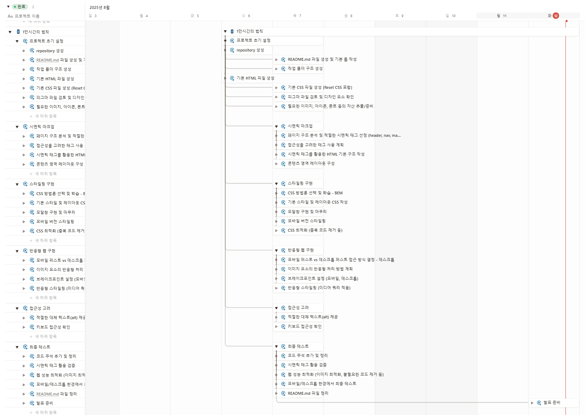

# 10000hours-rule

1만 시간의 법칙.
어떤 분야에서든 전문가가 되려면 해당 분야에 1만 시간 이상 투자해야 한다는 이론.
즉, 꾸준한 노력과 연습을 통해 특정 분야의 숙련자가 될 수 있다는 의미.

## 1. 목표와 기능

### 1.1 목표

- 기간 안에 페이지 완성하기
- HTML, CSS 만을 이용한 1만 시간의 법칙 페이지 만들기
- 시멘틱 마크업, 접근성, SEO, CSS 네이밍 방법론 고려하기
- 여러가지 화면에서도 문제 없는 반응형으로 작업하기

### 1.2 기능

특수한 기능은 없으나 고려해야 할 부분을 정리

1. HTML
   - 시맨틱 마크업 준수
   - 접근성 고려
   - SEO 고려
2. CSS
   - 반응형 제작
   - CSS 네이밍 방법론 고려

### 1.3 팀 구성

개인 프로젝트로 1인 개발.

## 2. 개발 환경 및 배포 URL

### 2.1 개발 환경

- VSCode

### 2.2 배포 URL

- https://jieunheo.github.io/10000hours-rule/

## 3. 요구사항 명세와 기능 명세

1. 피그마를 참고하여 페이지 구현을 합니다.
2. 모바일 화면도 고려하여 페이지 구현을 합니다.
3. 시멘틱 마크업, 반응형 웹, 접근성, SEO, CSS 네이밍 방법론 등을 고려해서 작업해주세요.
4. 모달창의 경우 퍼블리싱 해주신 후 화면에서 보이지 않게 숨김처리 해주시고 발표할 때 노출로 전환해서 보여주세요.
5. 자바스크립트로 추후 구현할 리스트
   1. `훈련하기 GO! GO!` 버튼 클릭시 모달창이 뜨도록 구현합니다.

[피그마 참고](https://www.figma.com/design/rbi8px4O2GrnXN4gK0ZaLv/WENIV_FE_%EC%8B%A4%EC%8A%B5-%EC%98%88%EC%A0%9C?node-id=116293-2&p=f&t=LFaLMLvHlLQi5l2R-0)

## 4. 프로젝트 구조와 개발 일정

### 4.1 프로젝트 구조

```
10000hours-rule
├─ images
│  ├─ click.png
│  ├─ clock.png
│  ├─ favicon.ico
│  ├─ licat.png
│  ├─ licat@0.5x.png
│  ├─ licat@1x.png
│  ├─ licat@2x.png
│  ├─ loading.png
│  ├─ logo-m.png
│  ├─ logo-m.svg
│  ├─ logo.png
│  ├─ quotes-close.png
│  ├─ quotes-open.png
│  ├─ quotes.png
│  ├─ readme
│  │  ├─ desktop.png
│  │  ├─ mobile.png
│  │  └─ schedule.png
│  ├─ title.png
│  ├─ title@0.5x.png
│  ├─ title@1x.png
│  └─ title@2x.png
├─ index.html
├─ README.md
└─ styles
   ├─ font.css
   ├─ reset.css
   ├─ style.css
   └─ style-mobile.css
```

### 4.2 개발 일정

25.08.07(목) ~ 25.08.08(금), 평일 기준 총 2일
(래포지토리 생성 및 index.html 파일 생성은 6일에 진행)

노션 간트 사용

## 5. 화면

### 5.1 pc 화면


### 5.2 mobile 화면


## 6. 메인 기능

- 시멘틱 태그 사용 (header, main, footer, h1, h2, ...)
- flex 사용
- input 태그에 텍스트 필수 입력 체크 (required)
- 팝업 (JavaScript 없이 팝업 위치만 스타일링)
- CSS 방법론 - BEM 방식으로 진행
- 가상요소와 backgroung-image 사용
- 반응형 웹 테스트 (pc/mobile 2단계)
  - 데스크톱 퍼스트 형식으로 진행
  - 모바일에서 텍스트 배치 변동

## 7. 에러와 에러 해결

### 7.1 텍스트의 여백

피그마의 시안을 보면서 작업하다보니 피그마에서의 텍스트 여백과 개발 화면에서의 텍스트 여백이 다른 것을 볼 수 있었다.
분명 같은 폰트를 가지고 진행하는데도 불구하고 위아래 여백을 작업하면 개발 화면에서는 뭔가 더 위로 떠보여서 위아래 여백이 맞지 않는 것 같았다.
vertical-align 이나 line-height 등의 속성을 건드려봤지만 아무런 변화가 없었다.
임의로 수정을 하기에는 문제가 있을 것으로 보여 우선 그대로 두었다.

### 7.2 피그마 Paragraph spacing

시안으로 확인하는 텍스트에는 line-height 값은 100%로 모두 동일하고 Paragraph spacing 라는 값에 변화가 있었다.
해당 값이 행간에 영향을 주는 코드인 것은 알았으나, CSS에서 동일한 속성이 없다.
그래서 눈대중으로 line-height를 주어 유사한 모양으로 만들어내기로 했다.
[참고 블로그](https://izizi.tistory.com/59)

### 7.3 데스크탑에선 1줄, 모바일에선 2줄

데스크탑 퍼스트 방식으로 작업을 하다보니 모바일에서 2줄이 되는 부분을 어떻게 작업해야 하나 고민을 하게 되었다.

1. flex
   브레이크포인트는 max-width: 756px을 두어 모바일 스타일링을 주기로 했다.
   flex를 사용한 값의 자식 요소에게 width: 100%를 주었지만 내가 원하는 모습이 되지 않았다.
   부모요소에게 flex-wrap을 wrap으로 주니 원하는 모습이 되었다.

2. span
   flex를 사용하지 않는 일반 텍스트에서 줄바꿈을 하려고 `wbr` 태그를 사용하니 이상하게 동작하였다.
   뷰포트 너비가 줄어들면 글자가 하나하나 밑으로 떨어지는 것을 보고 text-wrap: nowrap을 사용해봤지만 소용이 없었다.
   그래서 밑으로 떨궈야 하는 요소를 span으로 감쌌다.
   모바일 화면일 경우에 span으로 감싼 요소를 display: block으로 만들어서 아래로 떨어지도록 했다.

### 7.4 BEM 방법론

CSS 스타일링 시 class 네이밍을 하기 위해서 BEM 방법론을 선택했다.
블록(Block)\_\_엘리먼트(Element)--모디파이어(Modifier) 순서로 작성하는 방식의 네이밍 방법이다.
참고 블로그의 예시를 봐가면서 작성을 하는데도 이게 맞는지 여러번 고민하고 수정했던 거 같다.
블록과 엘리먼트를 고민하느라 각 요소가 어떤 요소인지에 대해 더 생각해볼 수 있는 시간이었던 거 같다.
내가 작성한 방식이 옳은 것인지도 의문이 들지만 그래도 뭔가 시도를 해봤다는 것에 의의를 두려고 한다.

[참고 블로그](https://nykim.work/15)

### 7.5 이미지 srcset

반응형 화면을 염두해서 이미지 처리 방식에 대해 고민했다.
srcset 속성을 이용하여 이미지를 세가지로 구분하여 적용했다.
이후 W3C validation 을 사용하여 확인해보니 오류가 있다고 했다.
친절한 설명을 확인해보니 sizes 속성을 함께 작성해야 한다고 한다.
sizes 속성을 이용하여 기준 사이즈를 작성해준 후 다시 W3C validation 확인을 해보니 해결되었다.

### 7.6 폰트

나의 눈이 이상한건지... 복사할 수 있도록 해서 제공해주신 @font-face를 이용하는데 이상하게 시안의 두께와 내 화면의 두께가 다른 거 같이 느껴졌다.
알고보니 폰트 이름을 잘못 작성해서 제대로 된 폰트 적용이 안되있던 탓이었다.
피그마 시안에서는 "Gmarket Sans"를 사용하면서 font-weight 값으로 두께를 조절하는 방식의 작업이었고, 준비된 폰트는 @font-face는 "GmarketSansMedium"과 "GmarketSansBold" 각각 이었다.
해당 폰트를 필요한 위치에서 font-family를 이용하여 불러와 사용하면서 문제가 해결되었다.

### 7.7 모달 위치

모달을 작업하면서 단순히 top, left 50%를 주고 transform: translate -50% 씩 사용해서 가운데 정렬을 했더니 위치가 엉뚱한 곳에 있기도 했다. 이 부분을 수정하기 위해 고민하다가 HTML 태그를 수정하기로 했다.
modal인 section을 감싸는 div를 만들어서 해당 값을 fiexd로 고정한 후 그 안에서 modal을 가운데로 정렬 했더니 스크롤은 되지만 뷰포트의 가운데 정렬이 되었다.

### 7.8 모달 세로 넘침 (코드리뷰)

모달을 가운데로 놓는 것만 신경쓰다보니 반응형 작업 시 모달의 세로가 뷰포트를 넘칠 수 있다는 것을 생각 못했다.
데스크톱 사이즈이지만 세로값이 작은 경우 내부 요소가 너무 커서 모달이 뷰포트를 벗어나는 현상이 있었다.
rem 값으로만 주었던 내부 요소들을 min() 또는 max()와 함께 vh, vw 단위를 사용해서 유동적으로 움직일 수 있도록 하였다.

### 7.9 flex 자식 요소의 강제 줄바꿈 (코드리뷰)

결과를 보여주는 부분을 flex를 사용하여 일정한 간격을 주는 방식으로 작업을 했다.
그러다보니 내부 strong 요소에 값이 길어지면 각자의 위치에서 텍스트 줄바꿈이 일어나는 현상이 있었다.
flex를 준 부모 요소에 flex-wrap을 wrap으로 수정하니 어느정도 보완되는 것을 확인했다.
완전한 해결은 아닐 수 있지만 각자 요소가 다 줄바꿈 되지 않기때문에 괜찮은 방법인 거 같다.

### 7.10 훈련시간 찾기 form

훈련시간을 찾는 form에서 훈련 시간을 입력하는 input을 아무런 조건 없이 숫자로만 잡아두었더니 음수나 너무 큰 숫자 또한 들어가게 되었다.
이를 보완하기 위해 input에 min과 max를 사용해서 입력할 수 있는 숫자 제한을 두었다.
음수가 입력되지 않도록 min은 0, 하루는 24시간이니 max는 24로 작성을 했다.
생각해보니 0시간은 실제 스크립트 구현 중에 문제가 생길 거 같아 min을 1로 다시 수정하였다.

button을 누르니 자동으로 전송이 되어 페이지가 다시 불러와지는 현상이 있었다.
이 부분을 보완하기 위해 처음에 button의 type을 button으로 수정했다.
이러니 기본 브라우저 유효성 검사가 안되는 문제가 생겼다.
그래서 JavaScript의 도움을 받아 유효성검사를 하는 부분 이후에 기본 동작을 막는 코드를 추가 하였다.
만약 실제 기능을 구현한다 하면 하단의 결과 부분에 입력한 값을 출력하도록 하면 될 거 같다.

## 8. 개발하며 느낀점

특별한 기능을 넣지 않은 화면 하나 구현하는 것도 이렇게 고민할 것이 많구나를 느꼈다.
시맨틱한 태그를 사용하여 각 요소에 의미를 부여하는 것부터 시간을 많이 썼던 거 같다.
비슷한 방식인 거 같은 스타일도 태그의 구조에 따라 스타일을 반영하는 방법이 달라질 수 있다는 것도 알게 되었다.
스타일을 작업하면서 생각처럼 되지 않는 부분도 꽤 많았고, 안다고 생각했던 속성도 가물가물해서 자꾸 검색을 하게 되었다.

class 네이밍을 구조적으로 하기 위해 BEM 방법론을 알아보고 사용해보았다.
한 번 사용해본 것으로는 감이 잘 잡히지 않아서 여러번 반복해야 할 거 같다.
그래도 class 이름에 HTML 태그의 구조를 담기 위해서 고민하다보니 HTML 태그 작성의 중요성도 느껴졌다.

또 피그마를 보면서 작업하다보니 피그마의 시안 모습을 내 개발 화면에 반영하는 것이 쉽지 않다는 것을 느꼈다.
피그마에서 확인 가능한 속성을 보고 작업을 하더라도 CSS로 온전히 옮길 수 없는 속성이 있었고 비슷한 방식의 속성을 사용하면서 유사한 화면을 만들기 위해 노력했다.
실무에서라면 디자이너와 소통을 하면서 맞춰가야 할 부분이지 않을까 싶었다.

모바일과 데스크탑을 작업하면서 브레이크 포인트를 어느 px로 잡아야 할지에 대해서도 고민을 많이 했다.
나는 브라우저 너비를 줄여가면서 디자인이 뭉게질 거 같은 위치인 768px로 진행했다.
최소 너비는 어느정도까지 감안해야 하는지도 알 수 없어서 검색해봤는데... 정답은 없는 거 같았다.

주어진 디자인의 중간 단계는 어떻게 작업을 하는게 맞는지에 대해서도 고민을 했다.
폰트의 배치나 크기, padding 등의 값을 소소하게 바꾸면서 유연한 화면 작업을 하는 것이 나은지
고정된 값을 확실하게 보여주는 것이 나은지 혼자서는 확답을 내리기 쉽지 않았던 거 같다.
우선은 고정값으로 작업 후 남은 시간에 유동적인 스타일을 줘보려 한다.

다 했다 싶으면 뭔가가 자꾸 야금야금 나온다...
끝날때까지 끝난게 아닌 작업...
